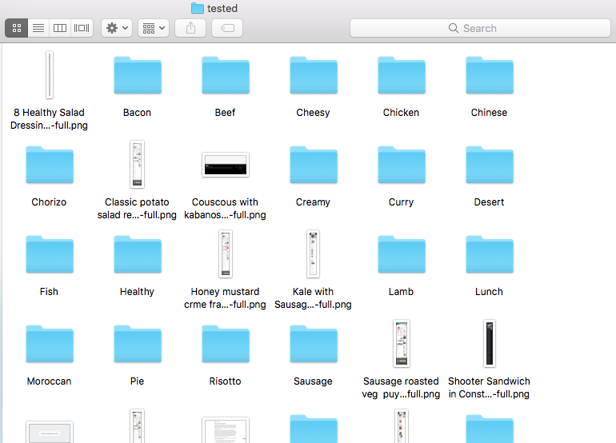

# SafariBookmarkSaver
Python code to save selected safari bookmarks to png images in a defined folder. The motivation for this project is my 'recipe book' which is actually a series of organised bookmarks i've tried and liked and those which I am yet to try. I've sometimes lost dishes to 404 pages or when there was the threat of BBC Good Food shuting down. Therefore the aim of this project is to replicate a bookmarks folder in png's in a permanent location on my computer.

## Getting Started

These instructions will get you a copy of the project up and running on your local machine for development and testing purposes. See deployment for notes on how to deploy the project on a live system.

### Prerequisites
Whilst the main bulk of the code will run on any operating system the initial reading of the bookmarks file has only been designed for reading the bookmarks.plist on macOS and the webkit2png module is also macOS only(alternatives to webkit2png seem to be avaliable, though I have not tested them), some slight changes will be needed to re-implement this project for further browsers/operating systems.

If you have installed webkit2png through homebrew there is an error introduced in the update to .... where non-HTTPS sites are rejected and the ignore-ssl flag does not work. Follow [this](https://github.com/bendalton/webkit2png/commit/9a96ac8977c386a84edb674ca1518e90452cee88) link for simple instructions on how to correct this, further information is avaliable [here](https://github.com/paulhammond/webkit2png/issues/100). 

### Running GUI

To run simply fill in, if desired a sub directory to start from in the reducedTitle variable and a destinatino folder for the png images which will be saved. 

Once run the result will be an folder with a png for every bookmark and a single text file containing details of any bookmarks that could not be saved. 

### Running CLI JSON Output

To run in CLI mode outputting to json the -j flag must be added along with a destination
for example `python SafariBookmarkSaver.py -j -d ./`

I combine the above CLI operation with another so that I can have recipe ideas selected on a weekly basis from the saved pool this can be done by a cron job if you know when your computer will be on or can be an aliased function on your profile
For the function 

`alias giveFood="python ~/Documents/Python\ Projects/Food\ Saver/SafariBookmarkSaver.py -S -n 6 -r 70 -t ~/Desktop`

or for the cron job, the osascript at the end is used to create a notification on MacOS

`0 18 * * MON . $HOME/.bash_profile; python ~/Documents/Python Projects/Food Saver/SafariBookmarkSaver.py -S -n 6 -r 70 -t ~/Desktop && osascript -e 'display notification "New Recipes Identified" with title "Recipes"'`

## Authors

* **Andrew Godley** - *All Work* - [AG Labs](https://github.com/AG-Labs)

## License

This project is licensed under the MIT License - see the [LICENSE.md](LICENSE.md) file for details
